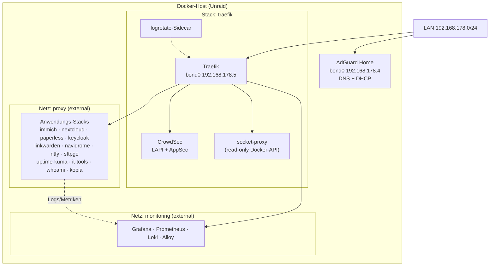

# Container — Homelab Docker-Stacks

Dieses Repository enthält die Compose-Definitionen aller selbst gehosteten Dienste.
Jedes Top-Level-Verzeichnis ist ein eigenständiger **Stack**, der in Portainer als
Git-Stack hinterlegt ist und beim Push automatisch neu deployt wird.

> Die Verzeichnisse [k8s/](k8s/), [vm/](vm/), [ansible/](ansible/) und
> [vm-ansible/](vm-ansible/) gehören nicht zum Docker-Setup, sondern zur parallelen
> Kubernetes-/VM-Migration (Terraform, Talos, Flux). Diese README beschreibt
> ausschließlich die Docker-Landschaft.

---

## 1. Deployment-Modell (Portainer)

```
git push  ──►  Git-Repository  ──►  Portainer (GitOps-Polling/Webhook)  ──►  docker compose up -d
```

* Pro Stack existiert in Portainer ein **Stack**, der auf dieses Repository zeigt.
* Als Compose-Dateien werden `<stack>/compose.yml` **plus** `<stack>/compose.prod.yml`
  eingebunden — Portainer merged beide in dieser Reihenfolge.
* `<stack>/compose.override.yml` wird in Produktion **nicht** verwendet. Docker Compose zieht
  Override-Dateien nur automatisch, wenn sie neben der Basisdatei liegen und nicht
  explizit überschrieben werden — die Prod-Datei ersetzt diese Rolle bewusst.
* Secrets kommen **nicht** aus dem Repository, sondern aus den Environment-Variablen
  des jeweiligen Portainer-Stacks. Welche Variablen ein Stack braucht, steht in
  `<stack>/example.env` bzw. `<stack>/.env.example` (`.env` ist über
  [.gitignore](.gitignore) ausgeschlossen).
* Der `name:`-Schlüssel am Kopf der `compose.yml` legt den Compose-Projektnamen fest
  und sollte mit dem Stack-Namen in Portainer übereinstimmen
  (Ausnahme: `grafana/` → Projektname `monitoring`).
* Image-Updates erledigt **Renovate** ([renovate.json5](renovate.json5)): Alle Images sind
  auf `tag@sha256:…` gepinnt, Renovate öffnet PRs, der Merge löst das Redeploy aus.

### Datei-Konvention pro Stack

| Datei | Zweck |
| --- | --- |
| `compose.yml` | Basis: Image, Healthcheck, Ressourcenlimits, Härtung, Logging, generische Env-Vars |
| `compose.override.yml` | Lokale Entwicklung: `user: 1000:1000`, Bind-Mounts nach `./data`, lokale Ports |
| `compose.prod.yml` | Produktion: `user: 99:100`, Bind-Mounts nach `/mnt/user/…`, Traefik-Labels, externe Netze, Secrets aus Env |
| `example.env` | Dokumentiert die benötigten Stack-Variablen |
| `README.md` / `Update und Restore.md` | Stack-spezifische Betriebshinweise, sofern vorhanden |

[_template/default/](_template/default/) enthält die kommentierte Vorlage für neue Stacks,
[_template/SECURITY-HARDENING.md](_template/SECURITY-HARDENING.md) und
[_template/Container-Hardening.md](_template/Container-Hardening.md) die Begründung der
Härtungs-Defaults.

Für die lokale Arbeit liegen IntelliJ-Run-Configs in [.run/](.run/); sie starten jeweils
`compose.yml` + `compose.override.yml`.

**Abweichungen:** [llm/](llm/), [octoprint/](octoprint/) und [ftb-skies-2/](ftb-skies-2/)
nutzen noch eine einzelne `docker-compose.yml` ohne Dev/Prod-Trennung.

---

## 2. Netzwerk-Architektur



| Netz | Typ | Zweck |
| --- | --- | --- |
| `proxy` | extern | Einziger Pfad zwischen Traefik und den Anwendungs-Containern |
| `monitoring` | extern | Scrape-/Push-Pfad zwischen Alloy, Prometheus, Loki, Grafana und Traefik |
| `bond0` | extern (macvlan/ipvlan, 192.168.178.0/24) | Eigene LAN-IPs für Traefik (`.5`) und AdGuard (`.4`) |
| `default` | stack-intern | Datenbank-/Cache-Verkehr innerhalb eines Stacks (Postgres, Valkey, Meilisearch, Tika, Gotenberg) |

Datenbanken und Caches hängen bewusst **nicht** im `proxy`-Netz und sind damit nur für
ihren eigenen Stack erreichbar.

---

## 3. Ingress: Traefik + CrowdSec

Der Stack [traefik/](traefik/) ist der einzige Eingang von außen und besteht aus vier Containern:

* **traefik** — statische Konfiguration ausschließlich über `TRAEFIK_*`-Environment-Variablen,
  dynamische Konfiguration über Docker-Labels und `/config/dynamic`.
* **docker-proxy** (`linuxserver/socket-proxy`) — Traefik erhält den Docker-Socket nie direkt,
  sondern nur einen lesenden Proxy mit `CONTAINERS`/`NETWORKS`/`PING`/`VERSION`.
* **crowdsec** — LAPI (`:8080`) und AppSec (`:7422`); wertet die Traefik-Access-Logs aus
  und speist die Bouncer-Middleware.
* **traefik-logrotate** — eigenes Mini-Image ([traefik/logrotate/](traefik/logrotate/)),
  teilt den PID-Namespace mit Traefik und rotiert die Logs per `USR1`, ohne Docker-Socket.

### Entrypoints

| Entrypoint | Port | Bemerkung |
| --- | --- | --- |
| `web` | 80 | permanenter Redirect auf `websecure` |
| `websecure` | 443 (TCP + UDP/HTTP3) | TLS via Let's Encrypt, Default-Middleware `secure-headers` |
| `sftpgo` | 2022 | TCP-Router für SFTP |
| `metrics` | 8082 | Prometheus |
| `ping` | 88 | Healthcheck |

### Zertifikate

Let's Encrypt mit **DNS-01-Challenge über IONOS** (`IONOS_API_KEY`, nur TXT-Berechtigung).
Dadurch funktionieren auch Wildcard- und rein interne `*.local.`-Hostnamen ohne offenen
Port 80 von außen.

### Middlewares (zentral im Traefik-Stack definiert)

| Middleware | Wirkung |
| --- | --- |
| `local-only` | IP-Allowlist `192.168.178.0/24` — nur LAN |
| `crowdsec` | CrowdSec-Bouncer (Live-Modus), LAN als `clientTrustedIPs` |
| `crowdsec-appsec` | zusätzlich WAF/AppSec, blockt bei Ausfall |
| `secure-headers` | HSTS inkl. Preload, `frameDeny`, XSS-/Nosniff-Header — Default auf `websecure` |
| `rate-limit` | 100 req/30 s, Burst 50 |
| `compress` | gzip/brotli |
| `cache-static-assets`, `cache-dynamic`, `no-cache` | Cache-Control-Profile |

**Faustregel:** Öffentlich erreichbare Dienste bekommen `crowdsec`, interne Dienste
`local-only`. Admin-Oberflächen öffentlicher Dienste werden über einen zweiten Router mit
höherer Priorität und `local-only` aus dem Internet herausgenommen (Keycloak `/admin`,
Paperless `/admin`, SFTPGo `/web/admin`).

---

## 4. Service-Katalog

Domain: `nico-steinmueller.de` — Hostnamen mit `.local.` sind ausschließlich im LAN erreichbar.

### Öffentlich erreichbar (CrowdSec-geschützt)

| Stack | Hostname | Container im Stack |
| --- | --- | --- |
| [immich/](immich/) | `immich.` | immich-server, machine-learning, Postgres (pgvector), Valkey |
| [nextcloud/](nextcloud/) | `cloud.` | nextcloud (lscr.io), Postgres, Valkey |
| [linkwarden/](linkwarden/) | `linkwarden.` | linkwarden, playwright-init, Postgres, Meilisearch |
| [navidrome/](navidrome/) | `music.` | navidrome |
| [ntfy/](ntfy/) | `ntfy.` | ntfy |
| [sftpgo/](sftpgo/) | `sftpgo.` + SFTP auf Port 2022 | sftpgo, Postgres |
| [keycloak/](keycloak/) | `keycloak.` | keycloak (eigenes [Dockerfile](keycloak/Dockerfile)), Postgres |

### Nur im LAN

| Stack | Hostname | Container im Stack |
| --- | --- | --- |
| [traefik/](traefik/) | `traefik.local.` (Dashboard) | traefik, crowdsec, docker-proxy, logrotate |
| [adguard/](adguard/) | `adguard.local.` | adguardhome (DNS + DHCP auf eigener LAN-IP) |
| [grafana/](grafana/) | `grafana.local.`, `prometheus.local.`, `alloy.local.` | grafana, Postgres, prometheus, loki, alloy |
| [paperless/](paperless/) | `paperless.` (zusätzlich `local-only`) | paperless-ngx, Postgres, Valkey, gotenberg, tika |
| [uptime-kuma/](uptime-kuma/) | `uptime-kuma.local.` | uptime-kuma |
| [it-tools/](it-tools/) | `it-tools.local.` | it-tools |
| [kopia/](kopia/) | `kopia-${INSTANCE}.local.` | kopia (mehrere Instanzen über `INSTANCE`) |
| [llm/](llm/) | `ollama-api.local.`, `open-webui.local.` | ollama, open-webui |
| [octoprint/](octoprint/) | `octoprint.local.` | octoprint |
| [whoami/](whoami/) | `whoami.` (`local-only`) | whoami — Testziel für die Traefik-Kette |

### Ohne Reverse Proxy

| Stack | Zugriff |
| --- | --- |
| [ftb-skies-2/](ftb-skies-2/) | Minecraft-Server, TCP-Port `55485` direkt auf dem Host |

---

## 5. Querschnittsthemen

### Single Sign-on

Keycloak ist der zentrale Identity Provider. Per OIDC angebunden sind derzeit
**Grafana**, **Paperless**, **SFTPGo** und **Linkwarden**; die Client-Secrets liegen
als Stack-Variablen (`KEYCLOAK_SECRET`, `OIDC_CLIENT_SECRET`, `KEYCLOAK_CLIENT_SECRET`).

### Observability

```
Container-Logs ─┐
Traefik-Logs   ─┼─► Alloy ─┬─► Loki       ─┐
System-Logs    ─┘          └─► Prometheus ─┴─► Grafana
```

Grafana Alloy ist der einzige Collector; seine Pipelines liegen als einzelne Dateien in
[grafana/alloy/](grafana/alloy/) (`docker`, `system-logs`, `system-metrics`, `traefik`,
`paperless`, `nextcloud`, `kopia`). Prometheus scrapt zusätzlich den `metrics`-Entrypoint
von Traefik ([grafana/prometheus.yml](grafana/prometheus.yml)). Uptime Kuma prüft
unabhängig davon die Erreichbarkeit von außen und meldet über ntfy.

### Backup

[kopia/](kopia/) mountet die `appdata`- und `data`-Pfade aller Stacks **read-only** und
sichert sie in ein Kopia-Repository. Der Stack ist über die Variable `INSTANCE`
mehrfach instanziierbar (z. B. lokales Ziel und Off-Site-Ziel), Router- und
Volume-Namen leiten sich daraus ab. Datenbanken werden vorher stack-seitig nach
`…/db-backup` gedumpt (Keycloak, Nextcloud).

### Datenablage auf dem Host

| Pfad | Inhalt |
| --- | --- |
| `/mnt/user/appdata/<stack>/` | Konfiguration und Datenbankdateien |
| `/mnt/user/data/<stack>/` | Nutzdaten (Medien, Dokumente, Backups) |
| `/mnt/user/logs/<stack>/` | Logdateien für Alloy und logrotate |

Alle Bind-Mounts nutzen `create_host_path: false` — fehlende Verzeichnisse führen bewusst
zu einem Fehler statt zu einem leeren Volume. In Produktion laufen die Container als
`99:100` (Unraid `nobody:users`).

### Härtung (Defaults aus dem Template)

* `security_opt: no-new-privileges:true`, wo möglich `cap_drop: ALL`
* `read_only: true` plus gezielte `tmpfs`-Mounts
* CPU-/RAM-/PID-Limits über `deploy.resources`
* `healthcheck` und `depends_on: condition: service_healthy` für geordnete Starts
* Logrotation über `logging: json-file` mit `max-size`/`max-file`
* Images auf Digest gepinnt, Updates ausschließlich über Renovate-PRs

---

## 6. Neuen Stack anlegen

1. [_template/default/](_template/default/) nach `<stack>/` kopieren und die drei Compose-Dateien anpassen.
2. `name:` setzen, Image mit `tag@sha256:` pinnen, Ressourcenlimits und Healthcheck festlegen.
3. In `compose.prod.yml` Traefik-Labels ergänzen — `local-only` oder `crowdsec` bewusst wählen —
   sowie das externe Netz `proxy` einhängen.
4. Benötigte Variablen in `example.env` dokumentieren.
5. Host-Verzeichnisse unter `/mnt/user/appdata` bzw. `/mnt/user/data` anlegen (werden nicht automatisch erzeugt).
6. Kopia-Mount für die neuen Datenpfade in [kopia/compose.prod.yml](kopia/compose.prod.yml) ergänzen.
7. Optional: Alloy-Pipeline in [grafana/alloy/](grafana/alloy/) und Uptime-Kuma-Check anlegen.
8. Stack in Portainer anlegen (Repository, beide Compose-Pfade, Environment-Variablen) —
   danach übernimmt jeder Push das Deployment.
